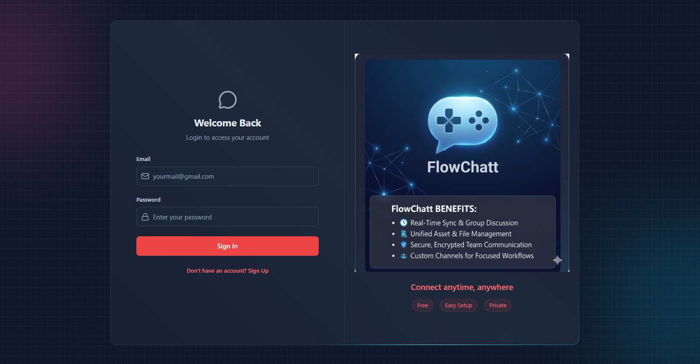
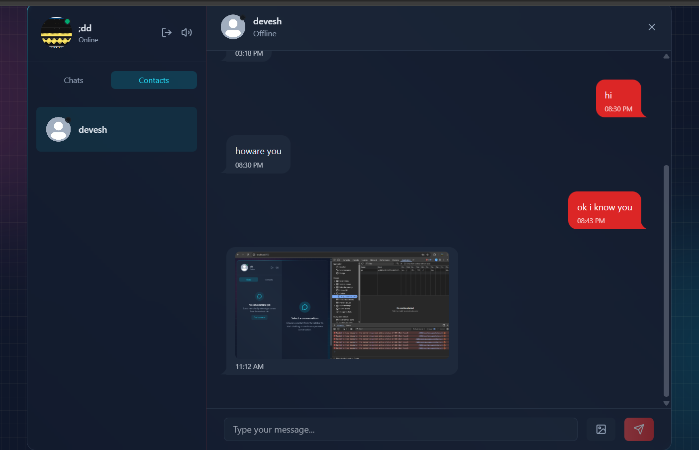
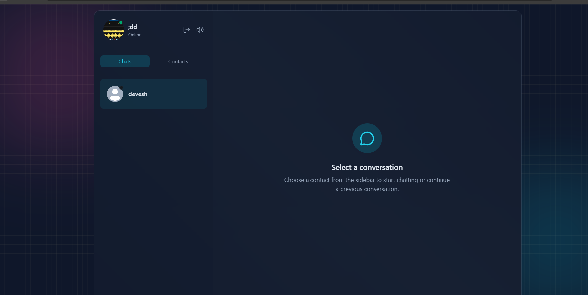

# 💬FlowChat

<p align="center">
  <strong>Real-Time Full Stack Chat Application with Authentication, Presence Tracking, Media Sharing & Live Messaging</strong>
</p>

<p align="center">
  Connect with friends through real-time messaging, image sharing, online presence tracking, and a modern responsive chat experience.
</p>

<p align="center">
  
  
  
  
  
  
  
  
</p>

---

## 🎯 Overview

FlowChat is a modern full-stack real-time chat application that enables users to communicate instantly through private messaging, media sharing, and live presence updates.

The application combines secure JWT authentication, WebSocket communication, cloud media storage, email notifications, and responsive UI design to deliver a seamless messaging experience.

Built using the MERN stack and Socket.io, Chatify demonstrates modern software engineering practices including REST APIs, state management, cloud integrations, security, and scalable application architecture.

---

## 📸 Screenshots

### 🔐 Authentication



### 🏠 Chat Dashboard



### 💬 Real-Time Conversations



---

## ✨ Features

### 🔐 Authentication & Security

* Custom JWT Authentication
* Secure Login & Registration
* Protected Routes
* Password Hashing
* Session Management

### 💬 Real-Time Messaging

* Instant One-to-One Messaging
* Socket.io Powered Communication
* Message Synchronization
* Typing Indicators
* Real-Time Notifications

### 🟢 Presence Tracking

* Online Status Indicators
* Offline Status Tracking
* Live User Activity Updates

### 🖼️ Media Sharing

* Image Upload Support
* Cloudinary Integration
* Secure Media Storage
* Instant Image Delivery

### 📨 Email Services

* Welcome Emails on Signup
* Resend Integration
* Automated Email Workflows

### 🎨 User Experience

* Responsive Design
* Modern UI Components
* Tailwind CSS Styling
* DaisyUI Components
* Notification Sound Controls

### ⚙️ Backend Features

* REST API Architecture
* Express.js Backend
* MongoDB Data Storage
* API Rate Limiting with Arcjet
* Scalable Server Structure

### 🧠 State Management

* Zustand Store
* Optimized State Updates
* Efficient Data Flow

---

## 🚀 Feature Showcase

### ⚡ Real-Time Communication

Send and receive messages instantly using Socket.io-powered WebSocket communication.

### 🟢 Live Presence Detection

Track online and offline users in real time without refreshing the application.

### 🖼️ Media Messaging

Share images securely through Cloudinary integration.

### 🔔 Smart Notifications

Receive visual and audio feedback for incoming messages and user activity.

### 🔐 Secure Authentication

JWT-based authentication system built from scratch without third-party auth providers.

---

## 🏗️ Tech Stack

### Frontend

| Technology       | Purpose                 |
| ---------------- | ----------------------- |
| React.js         | User Interface          |
| Tailwind CSS     | Styling                 |
| DaisyUI          | UI Components           |
| Zustand          | State Management        |
| Axios            | API Requests            |
| Socket.io Client | Real-Time Communication |

---

### Backend

| Technology | Purpose                 |
| ---------- | ----------------------- |
| Node.js    | Runtime Environment     |
| Express.js | REST APIs               |
| JWT        | Authentication          |
| Socket.io  | WebSocket Communication |
| Arcjet     | API Protection          |

---

### Database

| Technology | Purpose      |
| ---------- | ------------ |
| MongoDB    | Data Storage |
| Mongoose   | ODM          |

---

### Cloud Services

| Technology | Purpose        |
| ---------- | -------------- |
| Cloudinary | Media Storage  |
| Resend     | Email Delivery |

---

## 🏛️ System Architecture

```text
                 ┌───────────────┐
                 │     User      │
                 └───────┬───────┘
                         │
                         ▼

              ┌────────────────────┐
              │   React Frontend   │
              └─────────┬──────────┘
                        │

         ┌──────────────┼──────────────┐
         ▼              ▼              ▼

      Socket.io      REST API      Zustand

                        │
                        ▼

             ┌────────────────────┐
             │ Node.js + Express  │
             └─────────┬──────────┘
                       │

        ┌──────────────┼──────────────┐
        ▼              ▼              ▼

     MongoDB      Cloudinary      Resend

                       │
                       ▼

             Real-Time Chat Engine
```

---

## 📂 Project Structure

```text
Chatify
│
├── frontend
│   ├── assets
│   ├── public
│   ├── src
│   │   ├── components
│   │   ├── pages
│   │   ├── store
│   │   ├── hooks
│   │   └── services
│
├── backend
│   ├── controllers
│   ├── routes
│   ├── models
│   ├── middleware
│   ├── lib
│   └── utils
│
└── README.md
```

---

## ⚙️ Environment Variables

### Backend (.env)

```env
PORT=3000

MONGO_URI=your_mongo_uri_here

NODE_ENV=development

JWT_SECRET=your_jwt_secret

RESEND_API_KEY=your_resend_api_key

EMAIL_FROM=your_email_from_address
EMAIL_FROM_NAME=your_email_from_name

CLIENT_URL=http://localhost:5173

CLOUDINARY_CLOUD_NAME=your_cloudinary_cloud_name
CLOUDINARY_API_KEY=your_cloudinary_api_key
CLOUDINARY_API_SECRET=your_cloudinary_api_secret

ARCJET_KEY=your_arcjet_key
ARCJET_ENV=development
```

---

## 🛠️ Local Setup

### Install Backend

```bash
cd backend
npm install
npm run dev
```

### Install Frontend

```bash
cd frontend
npm install
npm run dev
```

### Open Application

```text
http://localhost:5173
```

---

## 🎓 Skills Demonstrated

* Full Stack Development
* Real-Time Systems
* Socket Programming
* REST API Development
* Authentication & Authorization
* State Management
* Database Design
* Cloud Integrations
* Secure File Uploads
* Modern UI Development
* Deployment & DevOps
* Software Engineering Best Practices

---

## 📄 License

This project is licensed under the MIT License.

---

<p align="center">
</p>
